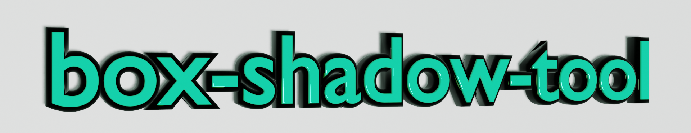

# 🎨boxshadowtool
This is a tool to generate values for the box shadow property in css.
You can adjust the value of the box-shadow property with the slider and see how the shadow actually looks on the screen.

# 🌐App URL
https://enumura1.github.io/box-shadow-tool/

# 👨‍💻how to use
1. If necessary, change to dark mode by toggling the switch in the upper right corner of the screen. The default is light mode.
2. Adjust the slider to adjust the value of the box-shadow property.
3. You can also change the background color of the shadow from the color palette.
4. You can copy the CSS for the output box-shadow property.

# 🌙theme
Dark and light modes are supported.
The theme can be changed by toggling the switch in the upper right corner of the screen.

# 🛠️development environment
- vue.js
- Vuetify
- vite
- vitest
- VSCode（Visual Studio Code）